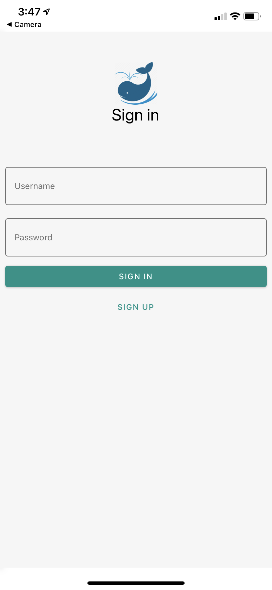
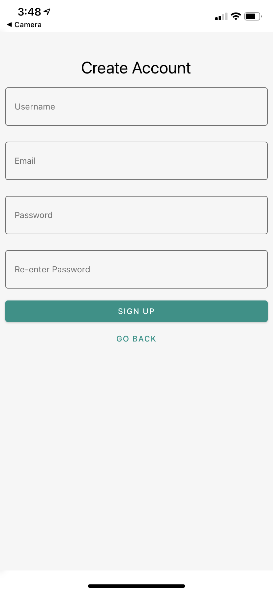
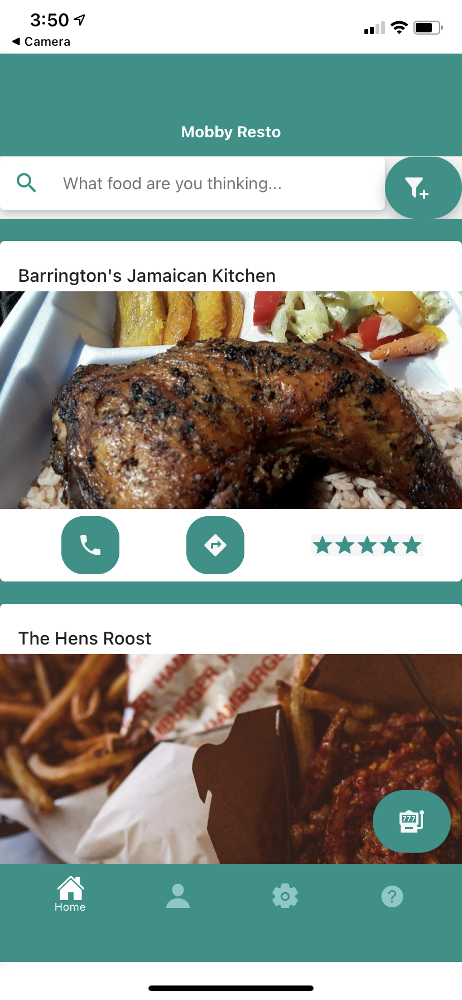
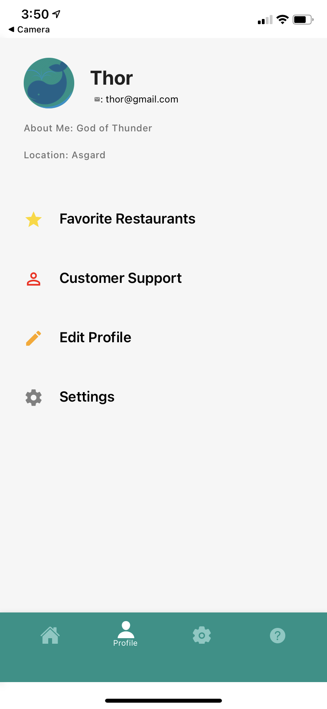
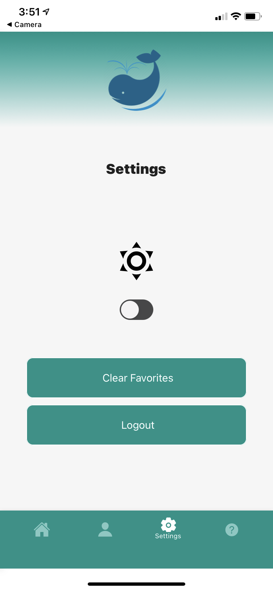
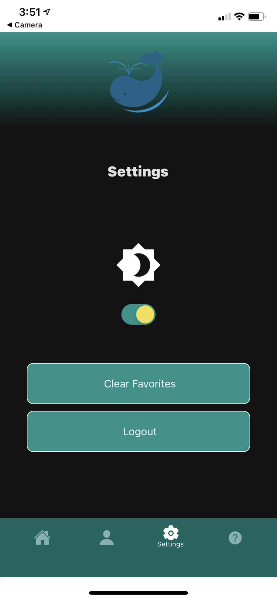
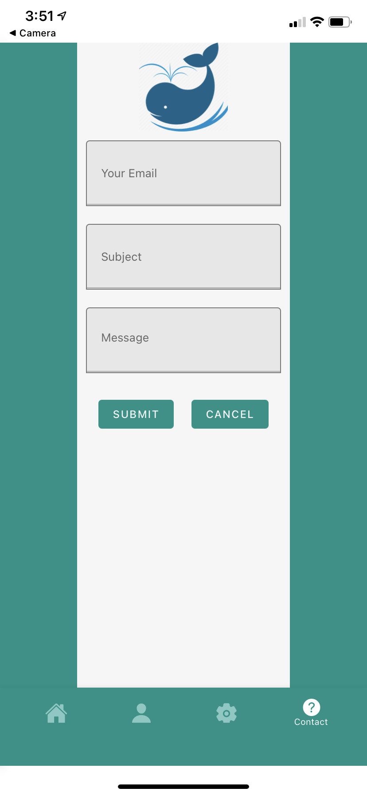

# Mobby Resto

Mobby Resto is a mobile application that is based on the idea of knowing the best restaurants in town; similar to Yelp but with built-in features like Google Maps.

## In-App Screenshots

   
   
   

   
   
    
      

## Created Using

- [React Native](https://facebook.github.io/react-native/)
  Cross-platform app development framework
- [React Native Paper](https://reactnativepaper.com)
  UI Library
- [Yelp API](https://www.yelp.com/developers/documentation/v3)
  API used to connect users to restaurants.
- [Expo](https://expo.io)
  Developer tool for making universal native apps that run on multiple platforms
- [Redux](https://redux.js.org)
  State management library

## Authors

- **Dylan Gonzalez**
- **James Tagaca**
- **Patrick Park**
- **Luis Aguilar**

## How to Build

- npm install
- npm start
- Disclaimer: This app requires a file with an API Key that not shared here to build it.
